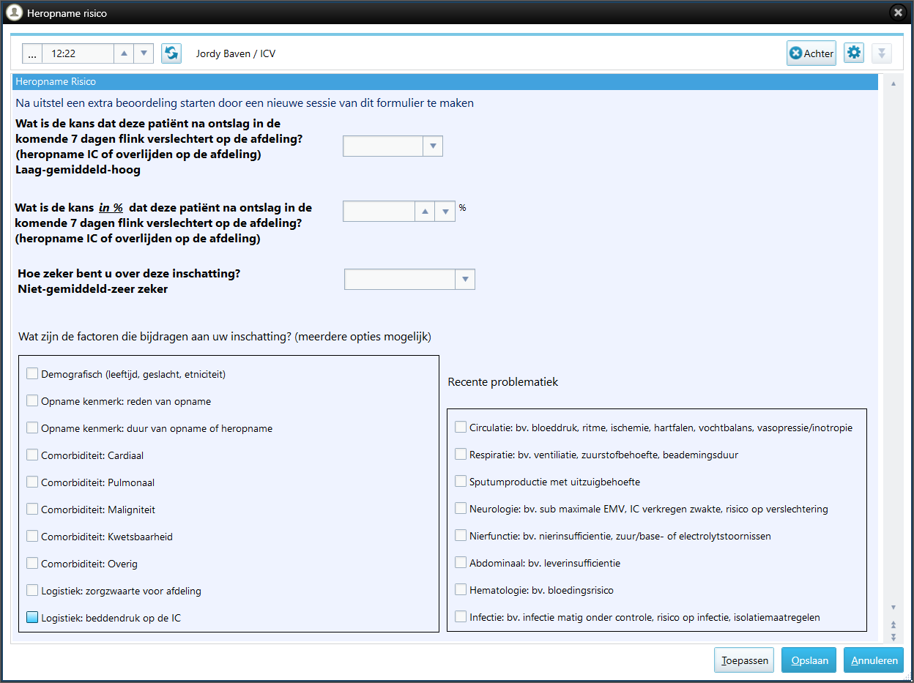
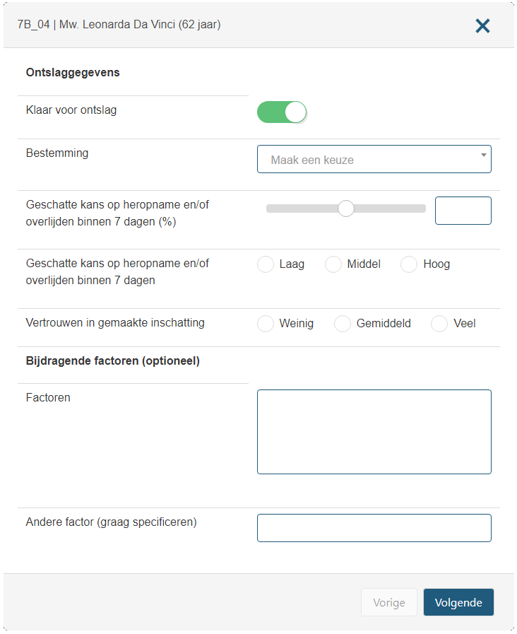

# Algo_vs_Doc

This repository contains code for analyzing the performance of an artificial intelligence system vs. intensivist expertise 
in predicting readmission or death after ICU discharge. The study evaluates the predictions by Pacmed Critical ('algo') and Intensivists ('docs') of two academic medical centers: 
[Amsterdam UMC, location VUmc](https://www.vumc.nl/) (VUmc), Amsterdam and [Leiden University Medical Center](https://www.lumc.nl/) (LUMC), Leiden, both in the Netherlands.

## What is Algo Versus Doc?

The Algo Versus Doc study was the first study around the implementation phases of Pacmed Critical Discharge.

During this period, intensivists (ICU consultants, 'docs') made predictions of the likelihood of readmission or mortality after discharge from the ICU. In the background, the model was doing predictions but intensivists were not able to see the Pacmed Critical UI or any of its predictions. Both VUmc and LUMC took part in study.

## What did we investigate?

Who is more accurate in predicting likelihood of readmission or mortality after discharge: the intensivist or the AI model?
Do the intensivist predictions improve by combining them with predictions by the AI model?

## Who did the analyses?

[Patrick Thoral](https://github.com/patrickthoral) (VUmc, currently OLVG) and [Anne de Hond](https://github.com/annedh93) (LUMC, currently UMC Utrecht) were the primary researchers. They were in charge of the analysis and developed the analysis code in this repository. The preprocessing to generate the data on which they could do their analyses was made by [Daan de Bruin](https://github.com/daandebruin) (Pacmed) initially, and updated by Patrick Thoral for final manuscript preparation.

## What is the input to the code in this repository?

- The forms filled in by the physicians containing their predictions, both for VUmc and LUMC
- The df model of the patients in scope, containing the features and outcomes required by the model
- The predictions done by the model, for VUmc the production predictions, for LUMC the predictions from the calibration code

LUMC intensivists documented their risk estimates and factors directly in MetaVision, the patient data management system, using a custom made form by Jordy Baven, Application Administrator, LUMC.




The predictions from VUmc were stored in a separate database (VUmc) using a web application developed by Patrick Thoral using an interface with the Epic Systems EHR. The backend for retrieving real-time data from the EHR was developed by Ronald Driessen, Clinical IT Specialist, VUmc.



## Getting started
This repository uses Python version 3.12.3 as its main programming language. Python package dependencies were managed using Poetry.

### Install Python
Install python from the official website: https://www.python.org/downloads/release/python-3123/

### Install poetry
Poetry is a Python packaging and dependency manager. Depending on your operating system, the installation procedure differs, so you it is recommend the official docs: https://python-poetry.org/docs/

For VS Code and possibly other IDEs: to allow detection of your virtual enviroment, the environment should be stored 
within the project folder. 

From a terminal/command prompt:
```bash
poetry config virtualenvs.in-project true
```

### Setup an environment 

To setup an environment for Python 3.12, and to install the dependencies into this environment, fom a terminal/command prompt type:
```bash
poetry install
```
This will install a clean environment in the (hidden) [`.venv`](./.venv/) containing the required packages including Jupyter Notebook, pandas and scikit-learn.

### Availability of data and materials
This repository contains the Jupyter [notebooks](./notebooks/) and [algo_vs_doc](./algo_vs_doc/) Python module to analyse the processed study data. Initially, the analyses were performed independently by both research due to legal Data Sharing agreement restraints but finally pooled for combined analyses of both hospitals. 

The two data sets for [VUmc](./data/merged_data_vumc.tsv) and [LUMC](./data/merged_data_lumc.tsv) are not included in this public repository to mitigate privacy risks and protect patient confidentiality. The datasets analysed are available for researchers on reasonable request directed to Patrick Thoral ([@patrickthoral](https://github.com/patrickthoral)).
